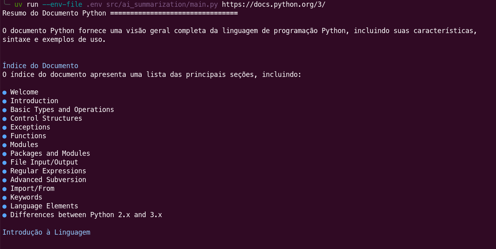

# AI Summarization

Simple AI summarization application to learn how to make API calls to local or remote LLMs. The summarization content is rendered as simple markdown.

## Setup

1. Install [uv](https://docs.astral.sh/uv/getting-started/installation/).
2. Run `uv sync`.
3. Copy `.env.example` and rename to `.env`.
3. Setup environment variables as:

|Name|type|Description|
|-|-|-|
|API_BASE_URL|url| The OpenAPI compatible endpoint for chat and tool calling.|
|API_KEY|text|The credential key to authenticate against the the api.|
|MODEL|text|The model name to be called from the api.|

## Use

1. Run `uv run --env-file=.env src/ai_summarization/main.py`.

Example of response:

